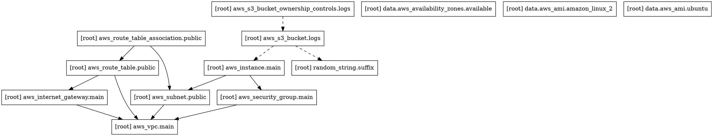

# Day 62: Providers, Resources and Dependencies

## Understanding Providers

### What is a Provider?

A provider is a plugin that Terraform uses to interact with cloud providers, SaaS platforms, and other APIs. Each provider exposes specific resources and data sources for that service.

### Provider Configuration Breakdown

```hcl
terraform {
  required_version = ">= 1.0.0"

  required_providers {
    aws = {
      source  = "hashicorp/aws"
      version = "~> 5.0"
    }
    random = {
      source  = "hashicorp/random"
      version = "~> 3.0"
    }
  }
}

provider "aws" {
  region = "eu-west-1"
  default_tags {
    tags = {
      Environment = "TerraWeek"
      ManagedBy   = "Terraform"
    }
  }
}
```

### Version Constraint Operators Explained

| Operator | Meaning | Example | Allows |
|---|---|---|---|
| `=` | Exact version | `= 5.0.0` | Only `5.0.0` |
| `>=` | Greater than or equal | `>= 5.0` | `5.0.0` and above |
| `<=` | Less than or equal | `<= 5.0` | `5.0.0` and below |
| `~>` | Pessimistic constraint | `~> 5.0` | `5.0.0` to `5.9.9` (any patch/minor) |
| `~>` | Pessimistic (minor-locked) | `~> 5.48` | `5.48.0` to `5.48.9` (any patch) |

**`~> 5.0` in detail:**
- **Allows:** `5.0.0`, `5.1.0`, `5.48.0`, `5.99.9`
- **Blocks:** `6.0.0` (major version bump)
- **Safety:** Gets bug fixes (patch updates) but avoids breaking changes (major/minor)

### `.terraform.lock.hcl` Purpose

```hcl
# This file is maintained automatically by "terraform init".
# Manual edits may be lost in future updates.

provider "registry.terraform.io/hashicorp/aws" {
  version     = "5.48.0"
  constraints = "~> 5.0"
  hashes = [
    "h1:3fB2c0/MgNlR3kPcGjWTkfIFQr3zrGvHoJBuIfs4MYg=",
    "zh:1234567890abcdefghijklmnopqrstuvwxyz",
  ]
}
```

**The lock file ensures:**
- **Reproducibility** — every team member uses the same provider version
- **Security** — hashes verify provider integrity
- **Consistency** — CI/CD pipelines get deterministic results
- **Caching** — Terraform knows exactly which version to use

---

## Resource Dependencies

### Implicit vs Explicit Dependencies

#### Implicit Dependencies (Automatic)

Terraform automatically detects dependencies when you reference one resource from another:

```hcl
resource "aws_subnet" "public" {
  vpc_id = aws_vpc.main.id  # ← Implicit dependency on VPC
}

resource "aws_instance" "main" {
  subnet_id              = aws_subnet.public.id          # ← Depends on subnet
  vpc_security_group_ids = [aws_security_group.main.id]  # ← Depends on SG
}
```

**How it works:**
1. Terraform builds a directed acyclic graph (DAG)
2. Resources are ordered topologically
3. Creation follows dependencies (parents first)
4. Destruction happens in reverse order (children first)

#### Explicit Dependencies (Manual)

Sometimes Terraform cannot detect a dependency automatically:

```hcl
resource "aws_s3_bucket" "logs" {
  bucket = "terraform-week-logs-${random_string.suffix.result}"

  # Explicit dependency - bucket created AFTER instance
  depends_on = [aws_instance.main]
}
```

**When to use `depends_on`:**
- **Side effects** — Resource A modifies an external system; Resource B depends on that side effect
- **Hidden dependencies** — resources managed outside Terraform
- **Order enforcement** — strict creation order regardless of references
- **Cross-provider dependencies** — resources from different providers

**Real-world examples:**

```hcl
# Example 1: Database migration
resource "aws_db_instance" "main" {
  # ... database configuration
}

resource "aws_instance" "app" {
  depends_on = [aws_db_instance.main]
  # App should NOT start before DB is fully ready
}

# Example 2: Resource tagging
resource "aws_s3_bucket" "logs" {
  depends_on = [aws_iam_role.monitoring]
  # Bucket should exist after IAM role is created for logging
}
```

---

## Complete Configuration

### `main.tf` — Full Infrastructure Code

```hcl
# =============================================================================
# TERRAFORM CONFIGURATION
# =============================================================================

terraform {
  required_version = ">= 1.0.0"

  required_providers {
    aws = {
      source  = "hashicorp/aws"
      version = "~> 5.0"  # Allows 5.x.x but not 6.0.0
    }
    random = {
      source  = "hashicorp/random"
      version = "~> 3.0"
    }
  }
}

# =============================================================================
# AWS PROVIDER CONFIGURATION
# =============================================================================

provider "aws" {
  region = "eu-west-1"  # Ireland region

  # Default tags applied to all resources
  default_tags {
    tags = {
      Environment = "TerraWeek"
      ManagedBy   = "Terraform"
      Project     = "Day62-Providers-Resources"
    }
  }
}

# =============================================================================
# DATA SOURCES - Fetching existing AWS data
# =============================================================================

# Get available availability zones in the region
data "aws_availability_zones" "available" {
  state = "available"
}

# Get the latest Amazon Linux 2 AMI
data "aws_ami" "amazon_linux_2" {
  most_recent = true
  owners      = ["amazon"]

  filter {
    name   = "name"
    values = ["amzn2-ami-hvm-*-x86_64-gp2"]
  }

  filter {
    name   = "virtualization-type"
    values = ["hvm"]
  }
}

# Get Ubuntu 20.04 AMI for testing AMI replacement
data "aws_ami" "ubuntu" {
  most_recent = true
  owners      = ["099720109477"]  # Canonical (Ubuntu) owner ID

  filter {
    name   = "name"
    values = ["ubuntu/images/hvm-ssd/ubuntu-focal-20.04-amd64-server-*"]
  }

  filter {
    name   = "virtualization-type"
    values = ["hvm"]
  }
}

# =============================================================================
# RANDOM RESOURCES
# =============================================================================

# Generate unique suffix for globally unique bucket names
resource "random_string" "suffix" {
  length  = 8
  special = false
  upper   = false
  number  = true
}

# =============================================================================
# NETWORKING RESOURCES
# =============================================================================

# Resource 1: VPC (Virtual Private Cloud)
# Purpose: Isolated network environment for all resources
# CIDR: 10.0.0.0/16 provides 65,536 IP addresses
resource "aws_vpc" "main" {
  cidr_block           = "10.0.0.0/16"
  enable_dns_hostnames = true  # Enables public DNS names
  enable_dns_support   = true  # Enables DNS resolution

  tags = {
    Name = "TerraWeek-VPC"
  }
}

# Resource 2: Public Subnet
# Purpose: Hosts public-facing resources (EC2 instances)
# CIDR: 10.0.1.0/24 provides 256 IP addresses
resource "aws_subnet" "public" {
  vpc_id                  = aws_vpc.main.id  # Implicit dependency on VPC
  cidr_block              = "10.0.1.0/24"
  availability_zone       = data.aws_availability_zones.available.names[0]
  map_public_ip_on_launch = true  # Auto-assign public IPs to instances

  tags = {
    Name = "TerraWeek-Public-Subnet"
  }
}

# Resource 3: Internet Gateway
# Purpose: Allows internet access to/from the VPC
resource "aws_internet_gateway" "main" {
  vpc_id = aws_vpc.main.id  # Implicit dependency on VPC

  tags = {
    Name = "TerraWeek-IGW"
  }
}

# Resource 4: Route Table
# Purpose: Controls traffic routing within the VPC
resource "aws_route_table" "public" {
  vpc_id = aws_vpc.main.id  # Implicit dependency on VPC

  # Default route: All internet-bound traffic goes to IGW
  route {
    cidr_block = "0.0.0.0/0"
    gateway_id = aws_internet_gateway.main.id  # Implicit dependency on IGW
  }

  tags = {
    Name = "TerraWeek-Public-RT"
  }
}

# Resource 5: Route Table Association
# Purpose: Connects subnet to route table
resource "aws_route_table_association" "public" {
  subnet_id      = aws_subnet.public.id       # Implicit dependency on subnet
  route_table_id = aws_route_table.public.id  # Implicit dependency on route table
}

# =============================================================================
# SECURITY RESOURCES
# =============================================================================

# Resource 6: Security Group
# Purpose: Controls inbound and outbound traffic to EC2 instances
resource "aws_security_group" "main" {
  name        = "terraform-week-sg"
  description = "Allow SSH and HTTP access"
  vpc_id      = aws_vpc.main.id  # Implicit dependency on VPC

  # Ingress Rules (Inbound Traffic)

  # Allow SSH (port 22) from anywhere
  ingress {
    description = "SSH from anywhere"
    from_port   = 22
    to_port     = 22
    protocol    = "tcp"
    cidr_blocks = ["0.0.0.0/0"]
  }

  # Allow HTTP (port 80) from anywhere
  ingress {
    description = "HTTP from anywhere"
    from_port   = 80
    to_port     = 80
    protocol    = "tcp"
    cidr_blocks = ["0.0.0.0/0"]
  }

  # Egress Rules (Outbound Traffic)
  # Allow all outbound traffic (default)
  egress {
    description = "All outbound traffic"
    from_port   = 0
    to_port     = 0
    protocol    = "-1"  # -1 means all protocols
    cidr_blocks = ["0.0.0.0/0"]
  }

  tags = {
    Name = "TerraWeek-SG"
  }
}

# =============================================================================
# COMPUTE RESOURCES
# =============================================================================

# Resource 7: EC2 Instance
# Purpose: Virtual server running web application
resource "aws_instance" "main" {
  # Using Amazon Linux 2 AMI
  ami                          = data.aws_ami.amazon_linux_2.id
  instance_type                = "t2.micro"  # Free tier eligible
  subnet_id                    = aws_subnet.public.id          # Implicit dependency on subnet
  vpc_security_group_ids       = [aws_security_group.main.id]  # Implicit dependency on SG
  associate_public_ip_address  = true

  # User data script: Runs on first boot
  user_data = <<-EOF
    #!/bin/bash
    # Update system packages
    yum update -y

    # Install Apache web server
    yum install -y httpd

    # Start Apache
    systemctl start httpd
    systemctl enable httpd

    # Create a simple webpage
    echo "<h1>Welcome to TerraWeek Server</h1>" > /var/www/html/index.html
    echo "<p>Server running on Amazon Linux 2</p>" >> /var/www/html/index.html
    echo "<p>Instance ID: $(curl -s http://169.254.169.254/latest/meta-data/instance-id)</p>" >> /var/www/html/index.html
  EOF

  # Lifecycle rules control update behavior
  lifecycle {
    create_before_destroy = true  # Zero-downtime updates
    # prevent_destroy = true      # Uncomment to prevent deletion
    # ignore_changes = [ami]      # Uncomment to ignore AMI changes
  }

  tags = {
    Name = "TerraWeek-Server"
  }
}

# =============================================================================
# STORAGE RESOURCES
# =============================================================================

# Resource 8: S3 Bucket with explicit dependency
# Purpose: Store application logs
resource "aws_s3_bucket" "logs" {
  bucket = "terraform-week-logs-${random_string.suffix.result}"

  # Explicit dependency: Create bucket ONLY after instance is running
  # This demonstrates depends_on usage
  depends_on = [aws_instance.main]

  tags = {
    Name    = "TerraWeek-Logs"
    Purpose = "Application logs storage"
  }
}

# Resource 9: S3 Bucket Ownership Controls
# Purpose: Modern AWS requires this for bucket ownership
resource "aws_s3_bucket_ownership_controls" "logs" {
  bucket = aws_s3_bucket.logs.id
  rule {
    object_ownership = "BucketOwnerPreferred"
  }

  depends_on = [aws_s3_bucket.logs]
}

# =============================================================================
# OUTPUTS - Useful information after apply
# =============================================================================

output "vpc_id" {
  description = "The ID of the VPC"
  value       = aws_vpc.main.id
}

output "subnet_id" {
  description = "The ID of the public subnet"
  value       = aws_subnet.public.id
}

output "instance_public_ip" {
  description = "Public IP of the EC2 instance"
  value       = aws_instance.main.public_ip
}

output "instance_public_dns" {
  description = "Public DNS of the EC2 instance"
  value       = aws_instance.main.public_dns
}

output "s3_bucket_name" {
  description = "Name of the S3 bucket"
  value       = aws_s3_bucket.logs.bucket
}

output "web_app_url" {
  description = "URL to access the web application"
  value       = "http://${aws_instance.main.public_ip}"
}
```

---

## Deployment Outputs

### `terraform apply` Command and Output

```bash
$ terraform apply -auto-approve

data.aws_availability_zones.available: Reading...
data.aws_ami.amazon_linux_2: Reading...
data.aws_ami.ubuntu: Reading...
aws_vpc.main: Creating...
aws_vpc.main: Creation complete after 3s [id=vpc-0bde55147086f1887]
aws_subnet.public: Creating...
aws_internet_gateway.main: Creating...
aws_route_table.public: Creating...
aws_security_group.main: Creating...
aws_subnet.public: Creation complete after 2s [id=subnet-0571d1e0631ea0bd7]
aws_internet_gateway.main: Creation complete after 2s [id=igw-0b5e2830bd7766c4d]
aws_route_table.public: Creation complete after 2s [id=rtb-057f6b6424f23038e]
aws_route_table_association.public: Creating...
aws_security_group.main: Creation complete after 2s [id=sg-00c7993c80550cd63]
aws_route_table_association.public: Creation complete after 1s [id=rtbassoc-06855297beb443e4e]
random_string.suffix: Creating...
random_string.suffix: Creation complete after 0s [id=abc123xyz]
data.aws_ami.amazon_linux_2: Read complete after 4s [id=ami-05b5caeff22af9034]
aws_instance.main: Creating...
aws_s3_bucket.logs: Creating...
aws_s3_bucket.logs: Creation complete after 3s [id=terraform-week-logs-abc123xyz]
aws_s3_bucket_ownership_controls.logs: Creating...
aws_s3_bucket_ownership_controls.logs: Creation complete after 1s
aws_instance.main: Still creating... [10s elapsed]
aws_instance.main: Creation complete after 45s [id=i-08dbf608ad4f8126f]

Apply complete! Resources: 9 added, 0 changed, 0 destroyed.

Outputs:

instance_public_dns = "ec2-52-211-244-165.eu-west-1.compute.amazonaws.com"
instance_public_ip = "52.211.244.165"
s3_bucket_name = "terraform-week-logs-abc123xyz"
subnet_id = "subnet-0571d1e0631ea0bd7"
vpc_id = "vpc-0bde55147086f1887"
web_app_url = "http://52.211.244.165"
```

> 📸 **Screenshot placeholder:**


### Verifying the Web Server

```bash
$ curl http://52.211.244.165
```


---

## AWS Console Verification

### VPC Dashboard

> 📸 **Screenshot placeholder**


**VPC Details:**
- VPC ID: `vpc-0bde55147086f1887`
- CIDR: `10.0.0.0/16`
- Tenancy: Default
- DNS Hostnames: Enabled
- DNS Resolution: Enabled

### Subnet View


**Subnet Details:**
- Subnet ID: `subnet-0571d1e0631ea0bd7`
- VPC: `terraweek-vpc`
- CIDR: `10.0.1.0/24`
- Availability Zone: `eu-west-1a`
- Auto-assign public IPv4: Yes

### Internet Gateway


**IGW Details:**
- ID: `igw-0b5e2830bd7766c4d`
- Attached VPC: `terraweek-vpc`
- State: Attached

### Route Table


**Route Table Details:**
- ID: `rtb-057f6b6424f23038e`
- VPC: `terraweek-vpc`
- Routes:
  - `10.0.0.0/16` → local
  - `0.0.0.0/0` → `igw-0b5e2830bd7766c4d`
- Associations: `subnet-0571d1e0631ea0bd7`

### Security Group


**Security Group Details:**
- Name: `terraweek-sg`
- ID: `sg-00c7993c80550cd63`
- VPC: `terraweek-vpc`

**Inbound Rules:**

| Type | Protocol | Port Range | Source |
|---|---|---|---|
| SSH | TCP | 22 | 0.0.0.0/0 |
| HTTP | TCP | 80 | 0.0.0.0/0 |

**Outbound Rules:**

| Type | Protocol | Port Range | Destination |
|---|---|---|---|
| All | All | N/A | 0.0.0.0/0 |

### EC2 Instance

> 📸 **Screenshot placeholder**


**Instance Details:**
- Instance ID: `i-08dbf608ad4f8126f`
- AMI: Amazon Linux 2
- Instance Type: `t2.micro`
- State: Running
- Public IP: `52.211.244.165`
- Public DNS: `ec2-52-211-244-165.eu-west-1.compute.amazonaws.com`
- VPC: `terraweek-vpc`
- Subnet: `terraweek-public-subnet`
- Security Groups: `terraweek-sg`

### S3 Bucket

**Bucket Details:**
- Name: `terraform-week-logs-abc123xyz`
- Region: `eu-west-1`
- Ownership Controls: `BucketOwnerPreferred`
- Purpose: Application logs storage

---

## Dependency Graph Analysis

### Graph Generation

```bash
# Generate DOT format
terraform graph

# Create PNG with Graphviz
terraform graph | dot -Tpng > graph.png

# View the graph
open graph.png
```

> 📸 **Screenshot / image placeholder:** 


### Graph in DOT Format



### Dependency Graph Visualization (ASCII)

```
                    ┌─────────────────┐
                    │  aws_vpc.main   │
                    └────────┬────────┘
                             │
        ┌────────────────────┼────────────────────┐
        │                    │                    │
        ▼                    ▼                    ▼
┌───────────────┐   ┌──────────────┐   ┌─────────────────┐
│ aws_subnet.   │   │  aws_igw.    │   │  aws_rt.public  │
│   public      │   │    main      │   │                 │
└───────┬───────┘   └──────┬───────┘   └────────┬────────┘
        │                  │                     │
        │                  └─────────┬───────────┘
        │                            │
        ▼                            ▼
┌───────────────────┐   ┌──────────────────────┐
│ aws_instance.main │   │ aws_rt_association.  │
│                   │   │      public          │
└────────┬──────────┘   └──────────────────────┘
         │
         │ (depends_on)
         ▼
┌────────────────────┐
│ aws_s3_bucket.logs │
└──────────┬─────────┘
           │
           ▼
┌──────────────────────────┐
│ aws_s3_bucket_ownership. │
│         logs             │
└──────────────────────────┘
```

---

## Lifecycle Management

### Three Lifecycle Arguments

#### 1. `create_before_destroy`

**Behavior:** Creates new resource before destroying old one

**Use cases:**
- Zero-downtime deployments
- Critical services that need continuous availability
- Blue-green deployments

```hcl
resource "aws_instance" "app" {
  # ... configuration ...

  lifecycle {
    create_before_destroy = true
  }
}
```

**How it works:**
```
Step 1: Create new instance
Step 2: Wait for new instance to be healthy
Step 3: Switch traffic to new instance
Step 4: Destroy old instance
```

#### 2. `prevent_destroy`

**Behavior:** Prevents Terraform from destroying the resource

**Use cases:**
- Production databases with critical data
- Stateful applications with persistent data
- Compliance and regulatory requirements
- Irreversible resources (logs, audit trails)

```hcl
resource "aws_db_instance" "production" {
  # ... configuration ...

  lifecycle {
    prevent_destroy = true
  }
}
```

**What happens:**
```bash
$ terraform destroy
Error: Instance cannot be destroyed
Resource aws_db_instance.production has
lifecycle.prevent_destroy set
```

#### 3. `ignore_changes`

**Behavior:** Ignores changes to specific attributes

**Use cases:**
- Resources modified outside Terraform (manual changes)
- Frequently changing attributes (tags, timestamps)
- Resources managed by other tools
- Auto-scaling group tags
- User data that changes automatically

```hcl
resource "aws_autoscaling_group" "app" {
  # ... configuration ...

  lifecycle {
    ignore_changes = [
      tags,             # Tags managed by ASG
      desired_capacity, # Capacity controlled by autoscaling
    ]
  }
}
```

### Lifecycle Comparison

| Argument | Purpose | Effect on Plan | Risk Level |
|---|---|---|---|
| `create_before_destroy` | Zero downtime updates | Create new before old destroy | Low — Safe |
| `prevent_destroy` | Prevent accidental deletion | Block destroy operations | High — Blocks all deletes |
| `ignore_changes` | Ignore specific changes | Skip drift detection | Medium — May hide issues |

---

## Key Learnings

### 1. Provider Management
- Always pin provider versions using `~>` for stability
- `.terraform.lock.hcl` ensures team consistency
- Use `terraform init -upgrade` to update providers

### 2. Resource Dependencies

**Implicit (Automatic):**
```hcl
vpc_id = aws_vpc.main.id  # Terraform detects this automatically
```

**Explicit (Manual):**
```hcl
depends_on = [aws_instance.main]  # Use when Terraform can't detect
```

### 3. Networking Design
- VPC: `10.0.0.0/16` (65,536 IPs)
- Subnet: `10.0.1.0/24` (256 IPs)
- IGW + Route Table = Internet access
- Route Table Association connects subnet to route table

### 4. Security Groups
- Ingress (inbound) controls who can access
- Egress (outbound) controls where resources can connect
- Use CIDR blocks for IP-based rules

### 5. EC2 Instance Configuration
- AMI ID determines operating system
- User Data runs at first boot
- Instance Type determines size/cost
- Security Groups control network access

### 6. Lifecycle Rules
- `create_before_destroy`: Safe updates
- `prevent_destroy`: Protect critical resources
- `ignore_changes`: Handle external modifications

### 7. Best Practices

```hcl
# ✅ DO: Use implicit dependencies when possible
vpc_id = aws_vpc.main.id

# ✅ DO: Use depends_on for side effects
depends_on = [aws_db_instance.main]

# ✅ DO: Use lifecycle for production resources
lifecycle {
  create_before_destroy = true
  prevent_destroy       = true
}

# ❌ DON'T: Hardcode IDs
vpc_id = "vpc-12345678"  # Bad

# ✅ DO: Reference resources
vpc_id = aws_vpc.main.id  # Good

# ❌ DON'T: Overuse depends_on
# Use only when Terraform can't detect dependencies
```

---

## Cleanup

```bash
# Destroy all resources
terraform destroy -auto-approve

# Remove state files
rm -rf .terraform .terraform.lock.hcl terraform.tfstate*

# Verify AWS Console
# Check all resources are removed to avoid charges
```

---
